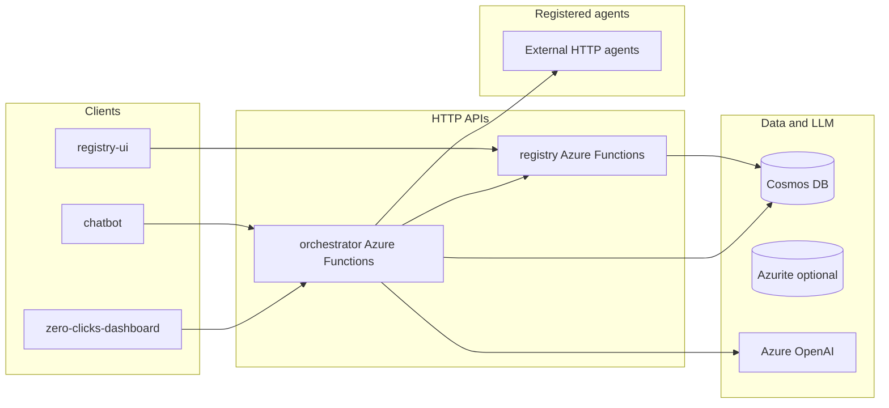

# Universal Utility Orchestrator

**Universal Utility Orchestrator** is a multi-agent orchestration system for utility-style customer support: it interprets a customer request, builds a dependency-aware execution plan over registered specialist agents, runs those agents, and synthesizes a single coherent answer. The **primary implementation** lives under **`azure/`**—Python Azure Functions apps (orchestrator and registry), Cosmos DB for persistence, optional Azure Storage (Azurite locally), Azure OpenAI for planning and synthesis, and React + Vite front ends for operators and customers.

**Problem:** Utility customers often need answers that span billing, usage, programs, and service requests; individual APIs or siloed agents do not coordinate plans or merge results.

**Who it is for:** Teams building agent marketplaces or “zero-click” support experiences—operators who register and health-check agents via a registry UI, and product teams exposing chat or dashboard UIs on top of the same orchestration API.

**Solution:** A central **orchestrator** service reads active agents from a **registry**, asks Azure OpenAI for a JSON plan, executes steps in order with dependency handling, persists session and step state to **Cosmos DB**, and calls Azure OpenAI again to **synthesize** the final user-facing reply.

---

## At a glance (what a grader needs)

| Question | Answer |
|----------|--------|
| **1. What is it?** | Azure-based orchestrator + agent registry + UIs; see [Overview](#overview) and [Features](#features-implemented). |
| **2. What works?** | Local Docker stack with emulators, `/api/chat` pipeline, registry CRUD, multiple UIs, CI gates; see [Features](#features-implemented) and [Evidence](#evidence-ci-tests-and-code). |
| **3. How do I run it?** | [Run locally (recommended)](#run-locally-recommended)—`docker compose` from `azure/` with `azure/orchestrator/.env`. |
| **4. What is the evidence?** | [`.github/workflows/`](.github/workflows/), [`tests/`](tests/), commits on the default branch; no demo URL or video is checked in—[Demo](#demo-video). |
| **5. What is missing?** | [Known issues and future work](#known-issues-and-future-work)—including duplicate `* 2.*` files and a missing `docker-compose.test.yml` referenced by `run_tests.sh`. |

**Where the “final” product code lives:** `UniversalUtilityAgent/azure/` (orchestrator, registry, three Vite apps, `docker-compose.yml`). Treat **`src/core/`** and the shell scripts under the repo root as **supplementary** (Ollama-oriented prototype and sample FastAPI agents), not the main delivery surface.

**Default branch:** Use your repository’s default branch (e.g. `main`) for review; feature branches should be compared against that branch in PRs.

---

## Team members and roles

No canonical team roster is stored in this repository. Add a short table here (name, role, contact) for course or organizational grading.

| Name | Role | Notes |
|------|------|-------|
| *TBD* | *TBD* | *Update this table.* |

---

## Overview

The system is designed around three ideas:

1. **Registry** — Agents are registered with endpoints, capabilities, auth configuration, and health metadata. Data is stored in Cosmos DB (or the Cosmos emulator locally).
2. **Orchestrator** — For each chat request, the service loads active agents, runs an LLM **planner** to produce an ordered plan with dependencies, executes each step via HTTP (**executor**), optionally records **demo trace** events, then runs a **synthesizer** LLM call to produce the final answer. Sessions and step results are persisted.
3. **Experience layer** — **Registry UI** (admin), **chatbot** (customer-style chat against the orchestrator), and **zero-clicks dashboard** (utility-style panels) are separate Vite apps that call the HTTP APIs.

Runtime behavior is governed by **`runtime_contract.py`** in each service: `APP_ENV`, `USE_LOCAL_EMULATORS`, strict mode, and auth levels must be consistent (especially for production).

---

## Features implemented

- **Agent registry (HTTP API)** — CRUD for agents, capabilities, status, health ping, export, stats, session-based admin auth (relaxed when using local emulators). See route overview in [`azure/registry/function_app.py`](azure/registry/function_app.py).
- **Orchestrator (HTTP API)** — `POST /api/chat` end-to-end: plan → execute → synthesize; `GET /api/health`; session and customer session listing; dashboard-style reads (`/api/insights`, `/api/copilot/context`, `/api/alerts`, alert acknowledge). Implemented in [`azure/orchestrator/function_app.py`](azure/orchestrator/function_app.py).
- **Azure OpenAI** — Planner and synthesizer use the Azure OpenAI client (deployment configurable via environment variables).
- **Cosmos DB** — Sessions, plans, step results, registry documents (production or **Cosmos emulator** locally).
- **Local emulators** — **Azurite** (blob/queue/table) and **Cosmos DB Linux emulator** wired in [`azure/docker-compose.yml`](azure/docker-compose.yml); one-shot **cosmos-init** creates database and containers.
- **Front ends** — `registry-ui`, `chatbot`, `zero-clicks-dashboard` (React 18 + Vite 5 + React Router).
- **CI** — Python lint/tests and dependency audits; registry UI production build. See [`.github/workflows/ci-pr.yml`](.github/workflows/ci-pr.yml) and [`main.yml`](.github/workflows/main.yml).

---

## Architecture



**Request flow (chat):** Client → orchestrator `POST /api/chat` → planner loads agents from registry → OpenAI returns JSON plan → executor calls each agent’s HTTP endpoint in dependency order → synthesizer merges step outputs → response stored and returned.

---

## Tech stack

| Layer | Technologies |
|-------|----------------|
| Orchestrator & registry | Python 3.11, Azure Functions Python programming model v2, Pydantic, `httpx`, `azure-cosmos`, `azure-identity`, `azure-keyvault-secrets`, `openai` |
| Persistence | Azure Cosmos DB (SQL API); Azurite for storage protocol locally |
| LLM | Azure OpenAI (chat completions for planning and synthesis) |
| Front ends | React 18, Vite 5, React Router 6/7 |
| Local orchestration | Docker Compose, Microsoft Cosmos emulator image, Azurite image |
| Quality | `pytest`, `ruff` (see workflows), `npm audit`, `pip-audit`, Gitleaks (workflow), dependency review on PRs |

---

## Setup instructions

1. **Clone** this repository and open the **`UniversalUtilityAgent`** directory (paths below are relative to that folder unless stated otherwise).
2. **Install Docker Desktop** (or equivalent) with **Docker Compose v2** (`docker compose`).
3. **Apple Silicon:** several Compose services use `platform: linux/amd64`; expect emulation overhead and allocate enough RAM (the Cosmos emulator alone is capped around 3 GB in Compose).
4. Create **`azure/orchestrator/.env`** with at least the variables in [Environment variables](#environment-variables). For the default local-emulator stack you only need the **Azure OpenAI** trio; Key Vault is not required when `USE_LOCAL_EMULATORS=true` is set by Compose.

---

## Run locally (recommended)

From the repository root (adjust if your clone layout differs):

```bash
cd UniversalUtilityAgent/azure
docker compose up --build
```

The Cosmos emulator often needs **30–45 seconds** on first boot. The **`cosmos-init`** container may retry until Cosmos is healthy; that is normal.

### Local URLs and ports

| Service | URL / ports | Notes |
|---------|-------------|--------|
| Registry UI | http://localhost:5173 | With local emulators: `admin` / `password` |
| Chatbot UI | http://localhost:5174 | Targets orchestrator on the host |
| Zero-clicks dashboard | http://localhost:5175 | Orchestrator-backed panels |
| Orchestrator API | http://localhost:7071 | Azure Functions host maps container `80` → `7071` |
| Registry API | http://localhost:7072 | Same mapping pattern |
| Cosmos emulator | https://localhost:8081 | TLS warnings are common; Data Explorer enabled in Compose |
| Azurite | blob `10000`, queue `10001`, table `10002` | Local storage endpoints |

Narrative detail (production-like flags, shims): [`azure/local.md`](azure/local.md).

### Azure folder layout

| Path | Purpose |
|------|---------|
| [`azure/orchestrator/`](azure/orchestrator/) | Orchestrator Function app: chat, sessions, insights, planner, executor, synthesizer, memory, traces |
| [`azure/registry/`](azure/registry/) | Registry Function app, Cosmos init script context |
| [`azure/registry-ui/`](azure/registry-ui/) | Operator UI for the registry |
| [`azure/chatbot/`](azure/chatbot/) | Chat UI |
| [`azure/zero-clicks-dashboard/`](azure/zero-clicks-dashboard/) | Utility-style dashboard UI |
| [`azure/docker-compose.yml`](azure/docker-compose.yml) | Full local stack |

---

## Environment variables

### Minimal local stack (`azure/orchestrator/.env`)

Used by Compose for orchestrator, registry, and cosmos-init. Typical local entries:

```bash
AZURE_OPENAI_API_KEY=your_key
AZURE_OPENAI_ENDPOINT=https://your-resource.openai.azure.com/
AZURE_OPENAI_DEPLOYMENT=gpt-4o
```

Compose overlays **`COSMOS_ENDPOINT`**, **`USE_LOCAL_EMULATORS`**, **`APP_ENV`**, auth levels, and CORS—see [`azure/docker-compose.yml`](azure/docker-compose.yml).

### Orchestrator contract (stricter modes)

From [`azure/orchestrator/runtime_contract.py`](azure/orchestrator/runtime_contract.py): production or **strict** mode additionally expects settings such as **`KEY_VAULT_URL`**, **`OPENAI_SECRET_NAME`**, **`BUILD_VERSION`**, **`BUILD_SHA`**, and disallows anonymous HTTP auth and demo-step flags incompatible with prod.

### Registry contract

From [`azure/registry/runtime_contract.py`](azure/registry/runtime_contract.py): **`COSMOS_ENDPOINT`** is always required; strict or prod adds **`KEY_VAULT_URL`**, **`BUILD_VERSION`**, **`BUILD_SHA`**.

### Front-end build-time variables

Compose sets `VITE_REGISTRY_URL`, `VITE_ORCHESTRATOR_URL`, and optional `VITE_FUNC_CODE` for function keys in non-local modes—see service `environment` blocks in `docker-compose.yml`.

---

## Agent endpoint contract

Each registered agent HTTP endpoint receives a JSON body shaped like:

```json
{
  "query": "user request",
  "step": {
    "id": "step_1",
    "objective": "step objective",
    "required_capabilities": ["..."],
    "dependencies": ["step_0"],
    "output_key": "..."
  },
  "context": {
    "dependency_outputs": {},
    "all_step_results": {}
  }
}
```

The orchestrator accepts **JSON or plain-text** responses from agents; the executor normalizes results for storage and synthesis (see [`azure/orchestrator/executor.py`](azure/orchestrator/executor.py)).

---

## Testing and verification

**Automated tests** (mocked, no real Azure calls in unit scope) live under [`tests/`](tests/). Instructions: [`tests/README.md`](tests/README.md).

**Host run (no Docker test image):**

```bash
pip install -r azure/orchestrator/requirements.txt
pip install -r azure/registry/requirements.txt
pip install -r tests/requirements-test.txt
PYTHONPATH="." pytest -q tests/runtime_contract
PYTHONPATH="azure/orchestrator" pytest tests/orchestrator/ -v
PYTHONPATH="azure/registry" pytest tests/registry/ -v
```

**Manual smoke after `docker compose up`:**

- `curl -s http://localhost:7071/api/health` and `http://localhost:7072/api/health` should return JSON with `"status": "ok"` when healthy.
- Open the Registry UI, sign in with local credentials, register a reachable mock agent if needed, then use the chatbot against `/api/chat`.

---

## Evidence (CI, tests, and code)

- **CI:** [`.github/workflows/ci-pr.yml`](.github/workflows/ci-pr.yml) — `pytest` for `tests/runtime_contract`, `tests/orchestrator`, `tests/registry`; `compileall`; `pip-audit` on both Python requirement sets; `registry-ui` `npm ci` + `npm run build` + high-severity `npm audit`; dependency review; Gitleaks.
- **Alternate workflow:** [`.github/workflows/main.yml`](.github/workflows/main.yml) — includes `ruff check` on `azure/orchestrator`, `azure/registry`, and `tests`.
- **Tests:** [`tests/README.md`](tests/README.md) documents layout and `PYTHONPATH` conventions.
- **Issues / screenshots / demo:** Not embedded in this README; add links when you have a tracking board, Loom, or deployed environment.

---

## Deployment and local-only status

- **Documented path:** Local-only full stack via **`azure/docker-compose.yml`** with emulators and Azure OpenAI in the cloud. This README does **not** assert a publicly hosted production URL.
- **Target cloud shape (implied by code):** Azure Functions for orchestrator and registry, Cosmos DB, Key Vault for secrets in strict/prod modes, Azure Storage as needed—validate against your subscription and IaC before go-live.
- **Handoff / Terraform:** Older README bullets referenced `handoff/` and `infra/terraform/`; those paths are **not present** in this workspace snapshot. Add them back to this section when those assets exist.

---

## Demo video

**None is linked in the repository.** Replace this sentence with an embed or URL when you have a walkthrough (for example: compose up, registry login, register agent, successful chat).

---

## Supplementary: Ollama prototype and sample agents

For a **non-Azure**, Ollama-based loop (useful for experiments), you can still use `run_dev.sh` and `src/core/orchestrator.py` as described in legacy docs; this path does **not** include the registry, Cosmos, or the Vite apps unless you wire them yourself.

Sample **FastAPI** agents and helper scripts (`run_anomaly_agent.sh`, `run_billing_agent.sh`, `stop_agents.sh`) exercise standalone agent HTTP servers on localhost ports **8000** / **8001**—useful for integration testing against the Azure orchestrator once those endpoints are registered.

---

## Known issues and future work

- **Duplicate files:** Several directories contain paired files such as `function_app 2.py`, `planner 2.py`, and `local 2.md`. They are confusing for reviewers; consolidate on a single canonical file per concern and delete duplicates when safe.
- **`run_tests.sh` vs Compose:** [`run_tests.sh`](run_tests.sh) invokes **`docker-compose.test.yml`**, which is **not present** in this tree—either add the file or update the script and [`tests/README.md`](tests/README.md) to match reality.
- **CI coverage gap:** Workflows build **`registry-ui`** only; **`chatbot`** and **`zero-clicks-dashboard`** are not built in CI—consider adding `npm ci` / `npm run build` jobs.
- **Production hardening:** Rate limiting, richer input guardrails, proactive triggers (some alternate planner paths exist only in duplicate modules), end-to-end tests against real Cosmos, and operational runbooks remain incremental work items.

---

## License and contributing

Add your license file and contribution guidelines if this repository is opened beyond the original team.
